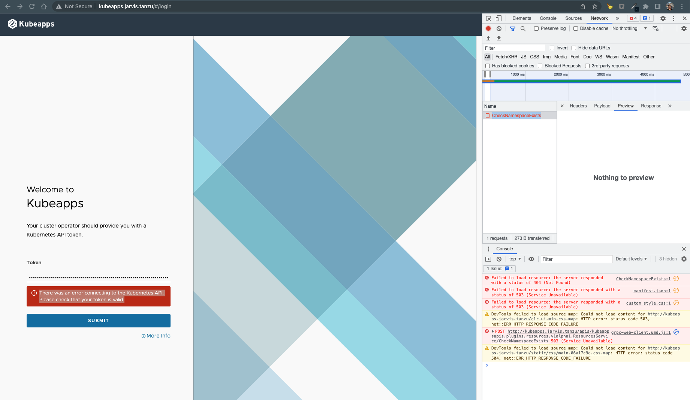

# Table of Content

- [Table of Content](#table-of-content)
  - [Kubeapps](#kubeapps)
  - [Prerequisites](#prerequisites)
  - [Installation](#installation)
    - [Access Kubeapps Portal](#access-kubeapps-portal)
    - [Kubeapps with Contour](#kubeapps-with-contour)
      - [Issue Kubernetes API Error](#issue-kubernetes-api-error)
      - [Solution Kubernetes API Error](#solution-kubernetes-api-error)
  - [Resources](#resources)

## Kubeapps

With Kubeapps you can:

- Customize deployments through an intuitive, form-based user interface
- Inspect, upgrade and delete applications installed in the cluster
- Browse and deploy Helm charts from public or private chart repositories (including VMware Marketplace™ and Bitnami Application Catalog)
- Browse and deploy Kubernetes Operators
- Secure authentication to Kubeapps using a standalone OAuth2/OIDC provider or using Pinniped
- Secure authorization based on Kubernetes Role-Based Access Control

> Note: Kubeapps 2.0 and onwards supports **Helm 3 only**. While only the Helm 3 API is supported, in most cases, charts made for Helm 2 will still work.

It also packages the Bitnami PostgreSQL chart, which is required for bootstrapping a deployment for the database requirements of the Kubeapps application.

## Prerequisites

- Kubernetes 1.16+ (tested with both bare-metal and managed clusters, including EKS, AKS, GKE and Tanzu Kubernetes Grid, as well as dev clusters, such as Kind, Minikube and Docker for Desktop Kubernetes)
- Helm 3.0.2+
- Administrative access to the cluster to create Custom Resource Definitions (CRDs)
- PV provisioner support in the underlying infrastructure (required for PostgreSQL database)

## Installation

- Using `helm` with a `values.yaml` file:

Example file: [kubeapps-values.yaml](data/kubeapps-values.yaml)

Ingress is set to `enabled: true` in this example. If you want to keep it, you have to adjust the hostname spec.

```yaml
ingress:
  ## @param ingress.enabled Enable ingress record generation for Kubeapps
  ##
  enabled: true
  ## @param ingress.apiVersion Force Ingress API version (automatically detected if not set)
  ##
  apiVersion: ""
  ## @param ingress.hostname Default host for the ingress record
  ##
  hostname: kubeapps.jarvis.tanzu
```

> **Attention:** When you are using Contour as ingress controller, you have to create a `httpproxy` object after the installation within the same namespace. See section [Kubeapps with Contour](#kubeapps-with-contour)

Use the following command in order to deploy kubeapps into the namespace `kubeapps`. The namepsace will be created by using the option `--create-namespace`.

```shell
helm install kubeapps \
--namespace kubeapps \
-f kubeapps_values.yaml \
bitnami/kubeapps \
--create-namespace
```

Alternative examples for the deployment via `helm` are:

- w/o a `values.yaml` file:

```shell
helm repo add bitnami https://charts.bitnami.com/bitnami \
kubectl create namespace kubeapps \
helm install kubeapps --namespace kubeapps bitnami/kubeapps
```

- w/o a `values.yaml` file and with w/ingress enabled:

```shell
helm install kubeapps --namespace kubeapps \
--set ingress.enabled=true \
bitnami/kubeapps
```

### Access Kubeapps Portal

For any user-facing installation you should configure an OAuth2/OIDC provider to enable secure user authentication with Kubeapps and the cluster, but this is quite an overhead to simply try out Kubeapps. Instead, for a simpler way to try out Kubeapps for personal learning, we can create a Kubernetes service account and use that API token to authenticate with the Kubernetes API server via Kubeapps:

> **Note:** The getting started guide on Github [here](https://github.com/vmware-tanzu/kubeapps/blob/main/site/content/docs/latest/tutorials/getting-started.md), is creating the `sa` in the `default` namespace which won't work. Please make sure using the same namespace as used for the kubeapps installation itself.

- Create a Kubernetes Serviceaccount named `kubeapps-operator`:

`kubectl create --namespace kubeapps serviceaccount kubeapps-operator`

- Create the necessary Clusterrolebinding for the Serviceaccount:

`kubectl -n kubeapps create clusterrolebinding kubeapps-operator --clusterrole=cluster-admin --serviceaccount=kubeapps:kubeapps-operator`

- Create an Access-Token for the Serviceaccount in order to login into the kubeapps dashboard:

```shell
cat <<EOF | kubectl apply -f -
apiVersion: v1
kind: Secret
metadata:
  name: kubeapps-operator-token
  namespace: kubeapps
  annotations:
    kubernetes.io/service-account.name: kubeapps-operator
type: kubernetes.io/service-account-token
EOF
```

- Retrieve the token by decoding the secret:

`kubectl get --namespace kubeapps secret kubeapps-operator-token -o jsonpath='{.data.token}' -o go-template='{{.data.token | base64decode}}' && echo`

### Kubeapps with Contour

There's a known issue when you are using Contour as an ingress controller with Kubeapps which is filed on Github [Issue #3716](https://github.com/vmware-tanzu/kubeapps/issues/3716#issuecomment-1067532124).

#### Issue Kubernetes API Error



> **TL;DR:** It is possible to run Kubeapps with the current contour (ie. without [projectcontour/contour#4290](https://github.com/projectcontour/contour/issues/4290) ) when using the demo-only, insecure, token authentication. I am not able to get Kubeapps working with Contour with OIDC. This may suite some users, but token authentication is something we recommend against using for anything other than demos.

#### Solution Kubernetes API Error

- Create a `httpproxy` object to fix the above described issue:

Adjust

```yaml
cat <<EOF | kubectl apply -f -
apiVersion: projectcontour.io/v1
kind: HTTPProxy
metadata:
  name: kubeapps-grpc
  namespace: kubeapps
spec:
  virtualhost:
    fqdn: kubeapps.jarvis.tanzu
  routes:
    - conditions:
      - prefix: /apis/
      pathRewritePolicy:
        replacePrefix:
        - replacement: /
      services:
      - name: kubeapps-internal-kubeappsapis
        port: 8080
        protocol: h2c
    - services:
      - name: kubeapps
        port: 80
EOF
```

This ensures that any requests to our kubeapps-apis service (ie. prefix /apis/) are not sent via the nginx frontend, but rather are routed directly by the Contour HTTPProxy through to the service using h2c and stripping the prefix in the process.

With this, Kubeapps appears to function perfectly fine with gRPC+web requests translated by contour.

**Optional:**

If you are using TLS certificates created by Contour, you can add it to the `httpproxy` spec as well.

```yaml
spec:
  virtualhost:
    fqdn: kubeapps.jarvis.tanzu
    tls:
      secretName: localhost-tls
```

## Resources

- [Getting Started with Kubeapps](https://tanzu.vmware.com/developer/guides/kubeapps-gs/)
- [Kubeapps on Github](https://github.com/vmware-tanzu/kubeapps)
- [Docs - Kubeapps by VMware](https://docs.vmware.com/en/VMware-Application-Catalog/services/apps/GUID-apps-kubeapps-index.html)