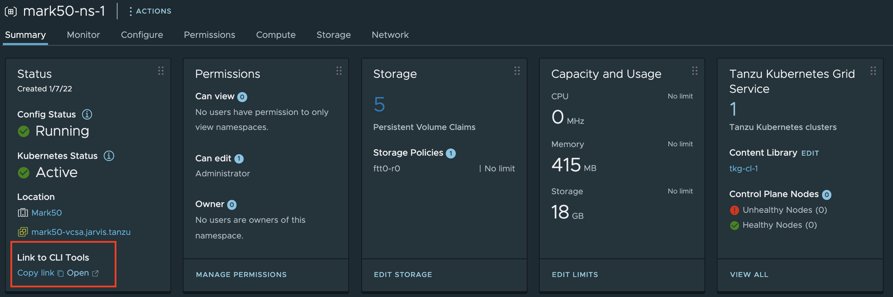
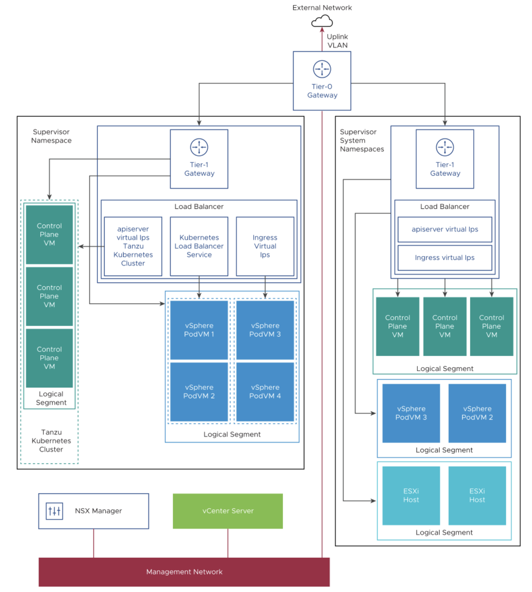

# Tanzu Kubernetes Grid Service (TKGs)

WIP :construction:

## Table of Content

- [Tanzu Kubernetes Grid Service (TKGs)](#tanzu-kubernetes-grid-service-tkgs)
  - [Table of Content](#table-of-content)
  - [Prerequisites](#prerequisites)
  - [Binaries](#binaries)
  - [CLIs](#clis)
    - [Kubectl](#kubectl)
    - [Kubectl vSphere](#kubectl-vsphere)
  - [Networking](#networking)
  - [Troubleshooting](#troubleshooting)
  - [Jumpbox](#jumpbox)
    - [Docker](#docker)
    - [Proxy](#proxy)
  - [Helpful Resources](#helpful-resources)

## Prerequisites

- [Licensing for vSphere with Tanzu](https://docs.vmware.com/en/VMware-vSphere/7.0/vmware-vsphere-with-tanzu/GUID-9A190942-BDB1-4A19-BA09-728820A716F2.html)
  - VMware vSphere 7 Enterprise Plus with Add-on for Kubernetes license assigned to each host from the Supervisor Cluster
  - Tanzu license for the Supervisor Cluster cluster
  - You can assign a Tanzu edition license key to multiple Supervisor Clusters at a time

- [Prerequisites for Configuring vSphere with Tanzu on a Cluster](https://docs.vmware.com/en/VMware-vSphere/7.0/vmware-vsphere-with-tanzu/GUID-EE236215-DA4D-4579-8BEB-A693D1882C77.html)
  - vSphere Cluster with at least 3 hosts
    - 4 hosts with vSAN
    - HA and DRS (fully automated) is required
  - vSAN File Services for persistent volumes in ReadWriteMany mode
  - User account has the Modify cluster-wide configuration permission to enable *Workload Management*

Table I: Choose and Configure the Networking Stack

| Functionality | NSX-T Networking | vDS Networking | Comment |
| :--: | :--: | :--: | :--: |
| vSphere Pods  | Yes | No | |
| Tanzu Kubernetes clusters  | Yes | Yes | |
| Embedded Harbor Registry  | Yes | No | |
| Load Balancing  | Yes | Yes, by installing and configuring the NSX Advanced Load Balancer or the HAProxy load balancer. | vSphere with Tanzu supports the NSX Advanced Load Balancer with vSphere 7 U2 and later.

- Subscribed Content Library
  - Subscription URL: <https://wp-content.vmware.com/v2/latest/lib.json>
  - OVF security policy: **OVF default policy**

- Local Content Library
  - Subscription URL: <https://wp-content.vmware.com/v2/latest/lib.json>
  - OVF security policy: **OVF default policy**
  - Synchronization Option
    - Immediately
    - When needed (two options to synchronize: entire library or a single item)

## Binaries

Since vSphere with Tanzu (Workload Management) is a vSphere Cluster feature, it's not necessary to download any additional installation binaries.

## CLIs

### Kubectl

[Install and Set Up kubectl on Linux](https://kubernetes.io/docs/tasks/tools/install-kubectl-linux/)

- Install kubectl binary with curl on Linux

```shell
curl -LO "https://dl.k8s.io/release/$(curl -L -s https://dl.k8s.io/release/stable.txt)/bin/linux/amd64/kubectl"
```

- Download a specific `kubectl` version

```shell
curl -LO https://dl.k8s.io/release/v1.23.0/bin/linux/amd64/kubectl
```

- Install using native package management

```shell
sudo apt-get update

sudo apt-get install -y apt-transport-https ca-certificates curl

sudo curl -fsSLo /usr/share/keyrings/kubernetes-archive-keyring.gpg https://packages.cloud.google.com/apt/doc/apt-key.gpg

echo "deb [signed-by=/usr/share/keyrings/kubernetes-archive-keyring.gpg] https://apt.kubernetes.io/ kubernetes-xenial main" | sudo tee /etc/apt/sources.list.d/kubernetes.list

sudo apt-get update

sudo apt-get install -y kubectl
```

- Autocompletion `kubectl`

```shell
source <(kubectl completion bash)

echo "source <(kubectl completion bash)" >> ~/.bashrc
```

- Set alias for kubectl to just `k`

```shell
echo "alias k='kubectl'" >> ~/.bashrc

complete -F __start_kubectl k
```

### Kubectl vSphere

[Download and Install the Kubernetes CLI Tools for vSphere](https://docs.vmware.com/en/VMware-vSphere/7.0/vmware-vsphere-with-tanzu/GUID-0F6E45C4-3CB1-4562-9370-686668519FCA.html)



- Password as an environment variable:

```bash
export KUBECTL_VSPHERE_PASSWORD=P@ssw0rd

kubectl vsphere login --vsphere-username administrator@vsphere.local --server=(IP or FQDN)
```

## Networking

- [Supervisor Cluster Networking](https://docs.vmware.com/en/VMware-vSphere/7.0/vmware-vsphere-with-tanzu/GUID-B156CDA6-B056-4D1C-BBC5-07D1A701E402.html)



- [Tanzu Kubernetes Cluster Networking](https://docs.vmware.com/en/VMware-vSphere/7.0/vmware-vsphere-with-tanzu/GUID-A7756D67-0B95-447D-A645-E2A384BF8135.html)

The table summarizes Tanzu Kubernetes cluster networking features and their implementation.

| Endpoint | Provider |	Description |
| :-- | :--: | --: |
| Pod connectivity |Antrea or Calico | Container network interface for pods. Antrea uses Open vSwitch. Calico uses the Linux bridge with BGP |
| Service type: ClusterIP |	Antrea or Calico | Default Kubernetes service type that is only accessible from within the cluster |
Service type: NodePort | Antrea or Calico | Allows external access through a port opened on each worker node by the Kubernetes network proxy |
Service type: LoadBalancer | NSX-T load balancer, NSX Advanced Load Balancer, HAProxy | For NSX-T, one virtual server per service type definition. For NSX Advanced Load Balancer, refer to that section of this documentation Note: Some load balancing features may not be available with HAProxy, such as support for static IPs |
| Cluster ingress | Third-party ingress controller | Routing for inbound pod traffic; you can use any third-party ingress controller |
| Network policy | Antrea or Calico | Controls what traffic is allowed to and from selected pods and network endpoints. Antrea uses Open vSwitch. Calico uses Linux IP tables |

## Troubleshooting

## Jumpbox

- [Download VMware PhotonOS](https://github.com/vmware/photon/wiki/Downloading-Photon-OS)
- [Create a Linux Jump Host VM](https://docs.vmware.com/en/VMware-vSphere/7.0/vmware-vsphere-with-tanzu/GUID-6DE3E58B-6AE3-4ABD-ABCC-2221B4230908.html)
- [Netshoot Virtual Appliance](https://github.com/josemzr/netshoot-virtual-appliance)
- [Demo Appliance for Tanzu Kubernetes Grid](https://flings.vmware.com/demo-appliance-for-tanzu-kubernetes-grid)

### Docker

[Install Docker Engine on Ubuntu](https://docs.docker.com/engine/install/ubuntu/)

- Uninstall old versions: `sudo apt-get remove docker docker-engine docker.io containerd runc`
- Set up the repository:

```bash
sudo apt-get update

sudo apt-get install \
    ca-certificates \
    curl \
    gnupg \
    lsb-release
```

- Add Docker’s official GPG key:

```bash
curl -fsSL https://download.docker.com/linux/ubuntu/gpg | sudo gpg --dearmor -o /usr/share/keyrings/docker-archive-keyring.gpg
```

- Install Docker Engine

```shell
sudo apt-get update

sudo apt-get install docker-ce docker-ce-cli containerd.io
```

- Manage Docker as a non-root user

```bash
sudo groupadd docker

sudo usermod -aG docker $USER
```

[Install Docker Engine on RHEL](https://docs.docker.com/engine/install/rhel/)

- Uninstall old versions:

```bash
sudo yum remove docker \
                  docker-client \
                  docker-client-latest \
                  docker-common \
                  docker-latest \
                  docker-latest-logrotate \
                  docker-logrotate \
                  docker-engine \
                  podman \
                  runc
```

or

```bash
sudo yum remove docker-ce docker-ce-cli containerd.io

sudo rm -rf /var/lib/docker

sudo rm -rf /var/lib/containerd
```

- Install using the repository

```bash
sudo yum install -y yum-utils

sudo yum-config-manager \
    --add-repo \
    https://download.docker.com/linux/rhel/docker-ce.repo
```

- Install Docker Engine

```bash
sudo yum install docker-ce docker-ce-cli containerd.io
```

- Install a specific version of Docker Engine

```bash
yum list docker-ce --showduplicates | sort -r
```

- Start Docker

```bash
sudo systemctl start docker
```

- Manage Docker as a non-root user

```bash
sudo groupadd docker

sudo usermod -aG docker $USER
```

### Proxy

## Helpful Resources

- [Tanzu Proof of Concept Guide](https://core.vmware.com/resource/tanzu-proof-concept-guide#poc-guide-overview)
- [Verify and Troubleshoot vSphere 7 with Kubernetes](https://beyondelastic.com/2020/07/17/verify-and-troubleshoot-vsphere-7-with-kubernetes/)
- [vSphere with Tanzu - SupervisorControlPlaneVM stucks in state NotReady](https://rguske.github.io/post/vsphere-with-tanzu-supervisor-control-plane-vm-stucks-in-state-not-ready/)
  